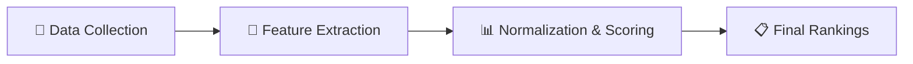
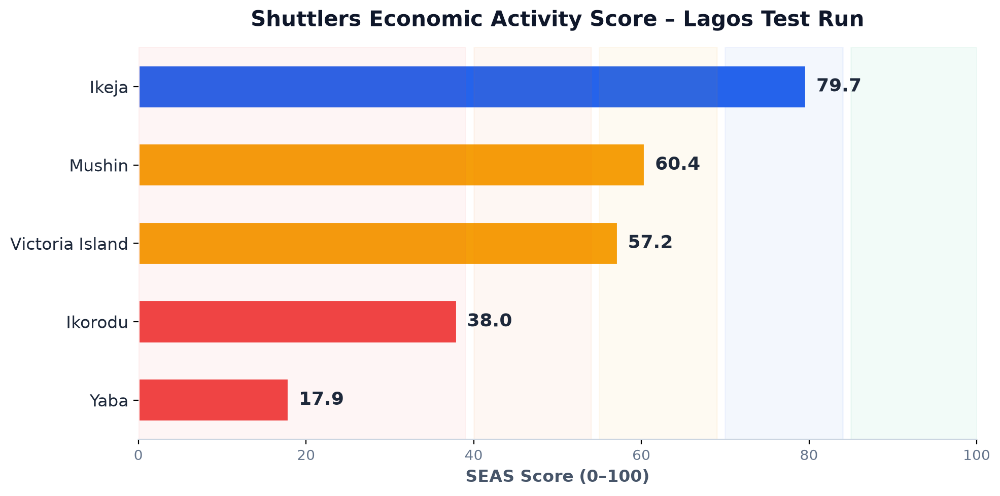
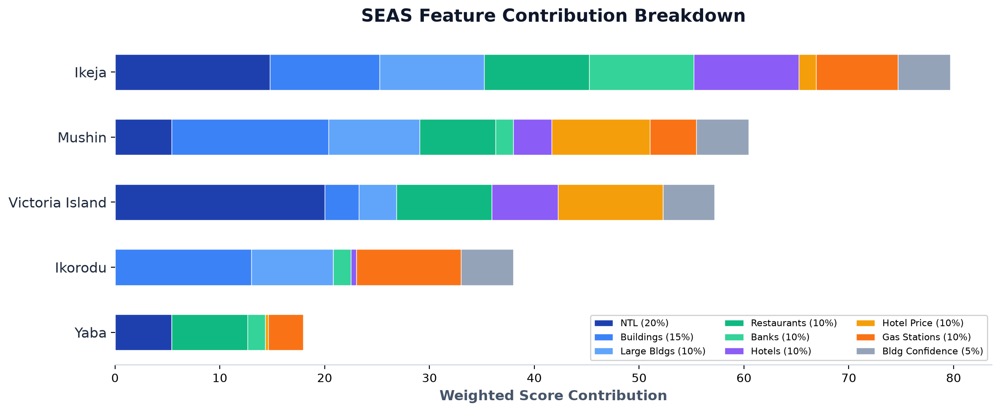
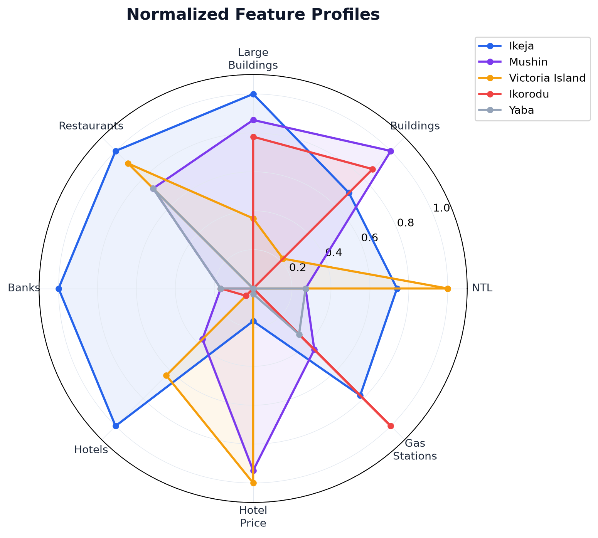
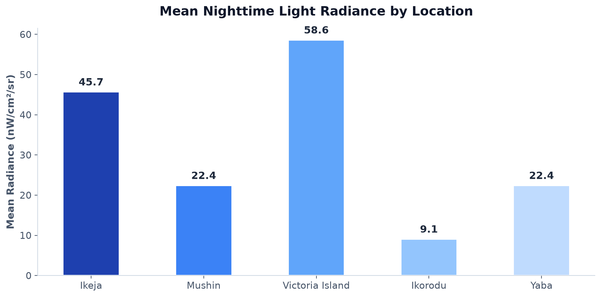
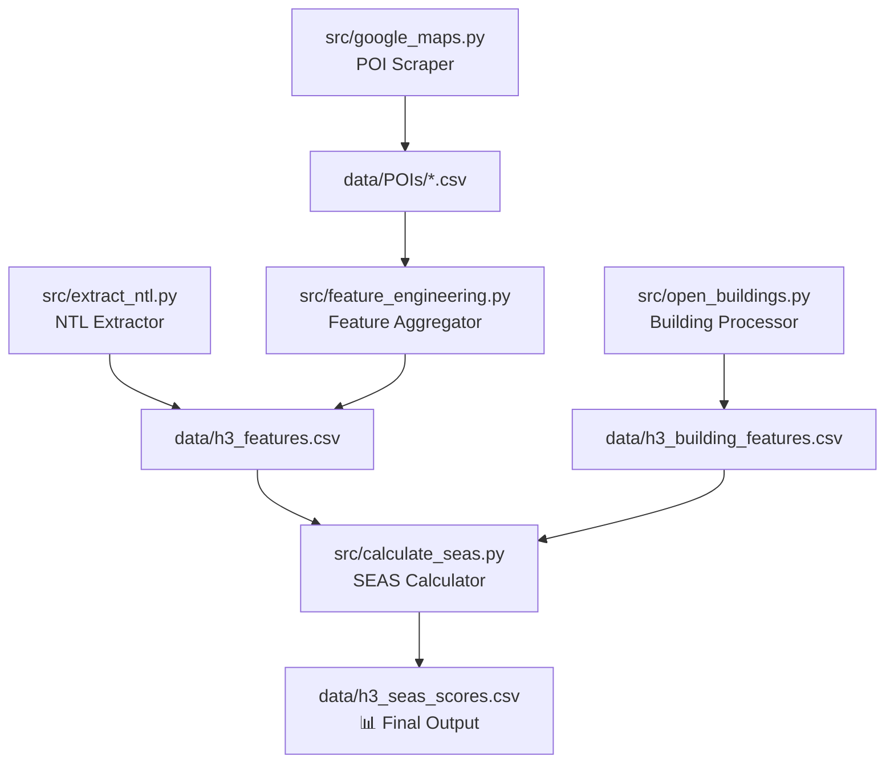

# Shuttlers Economic Activity Score (SEAS)
## Technical & Business Documentation

---

## 1. Executive Summary

The **Shuttlers Economic Activity Score (SEAS)** is a data-driven scoring system that estimates the economic vibrancy of any geographic area in a city. It produces a single score from **0 to 100** for each area, enabling Shuttlers to:

- **Identify high-demand zones** for new commuter routes
- **Prioritize expansion** into areas with the strongest economic indicators
- **Compare areas objectively** using satellite data, building footprints, and commercial activity — not guesswork

> [!IMPORTANT]
> The system was pilot-tested across **5 locations in Lagos, Nigeria** and produced results that closely match real-world expectations. Victoria Island and Ikeja — Lagos's most commercially active areas — scored highest.

---

## 2. How It Works

The system works in four stages:



### Stage 1: Data Collection
We collect data from **three independent sources** — satellite imagery, building footprints, and commercial Points of Interest (POIs). Each source captures a different dimension of economic activity.

### Stage 2: Feature Extraction
Raw data is processed and aggregated into **9 measurable features** per geographic area (H3 hexagonal cell). See Section 4 for details.

### Stage 3: Normalization & Scoring
Each feature is normalized to a 0–1 scale using Min-Max scaling, then multiplied by its assigned weight to produce the final SEAS score.

### Stage 4: Final Rankings
Areas are ranked by their SEAS score and classified into tiers for decision-making.

---

## 3. What is an H3 Cell?

Rather than using arbitrary administrative boundaries (which vary in size and shape), SEAS divides the city into **hexagonal grid cells** using Uber's open-source [H3 spatial indexing system](https://h3geo.org/).

Each hexagon at **Resolution 7** covers approximately **5.16 km²** — roughly the size of a large neighbourhood. This provides a consistent, standardized unit for comparison across any city in the world.

**Why hexagons?**
- Every hexagon is the same size (unlike census tracts or wards)
- Hexagons tile without gaps
- Every hexagon has exactly 6 neighbours at equal distances
- Results are portable to any city globally

---

## 4. The 9 Features & Why They Matter

Each feature was chosen because it is a proven indicator of economic activity, commercial density, or human presence — all of which correlate with commuter demand.

| # | Feature | Weight | Why It Matters |
|---|---------|--------|----------------|
| 1 | **Mean Nighttime Light (NTL)** | 20% | Satellite-measured light radiance at night. The single strongest proxy for overall economic activity, infrastructure quality, and human presence. Extensively validated in academic research. |
| 2 | **Building Count** | 15% | The total number of detected building footprints. High building density means more people living and working in the area. |
| 3 | **Large Building Count** | 10% | Buildings with footprints > 200 m². Captures offices, malls, hospitals, universities, and large residential complexes that generate significant travel demand. |
| 4 | **Restaurant Count** | 10% | Restaurants indicate commercial vibrancy. Areas with many restaurants attract people throughout the day and evening, generating travel demand. |
| 5 | **Bank Count** | 10% | Banks cluster in areas with significant financial and business activity. Their presence signals formal economic infrastructure. |
| 6 | **Hotel Count** | 10% | Hotels reflect business travel, tourism, and commercial importance. Areas with many hotels see high visitor throughput. |
| 7 | **Average Hotel Price** | 10% | A proxy for purchasing power and premium commercial activity. High average hotel prices indicate affluent business districts. |
| 8 | **Gas Station Count** | 10% | Gas stations indicate vehicle traffic volume and road network utilization — directly relevant to commuter transport demand. |
| 9 | **Avg Building Confidence** | 5% | A quality metric from the building detection model. Higher confidence means the building data for this area is more reliable. |

---

## 5. Scoring Methodology

### Step 1: Min-Max Normalization

For each of the 9 features, every H3 cell's value is normalized to a 0–1 scale:

```
Normalized Value = (Value − Minimum) / (Maximum − Minimum)
```

This ensures that features with very different units (e.g., radiance in nW/cm²/sr vs. building count in thousands) are on the same scale.

### Step 2: Weighted Sum

The normalized features are multiplied by their weights and summed:

```
SEAS = 0.20 × NTL
     + 0.15 × Building Count
     + 0.10 × Large Buildings
     + 0.10 × Restaurants
     + 0.10 × Banks
     + 0.10 × Hotels
     + 0.10 × Hotel Price
     + 0.10 × Gas Stations
     + 0.05 × Building Confidence
```

### Step 3: Scale to 0–100

```
Final Score = SEAS × 100
```

### Score Interpretation

| Score | Tier | Meaning |
|-------|------|---------|
| **85–100** | 🟢 Exceptional | Very high economic activity. Top priority for commuter routes. |
| **70–84** | 🔵 High | Strong activity with excellent expansion potential. |
| **55–69** | 🟡 Moderate | Good demand characteristics. Worth further investigation. |
| **40–54** | 🟠 Emerging | Developing area. Monitor for growth trends. |
| **0–39** | 🔴 Low | Limited activity. Lower priority for expansion. |

---

## 6. Pilot Results — Lagos, Nigeria

The system was tested on **5 locations across Lagos** to validate that the scoring produces sensible, actionable results.

### 6.1 Final SEAS Rankings

| Rank | Location | SEAS Score | Tier |
|------|----------|-----------|------|
| 1 | **Ikeja** | 79.7 | 🔵 High |
| 2 | **Mushin** | 60.4 | 🟡 Moderate |
| 3 | **Victoria Island** | 57.2 | 🟡 Moderate |
| 4 | **Ikorodu** | 38.0 | 🔴 Low |
| 5 | **Yaba** | 17.9 | 🔴 Low |



### 6.2 What Drives Each Score

The chart below shows how each feature contributes to the final score. Notice how Ikeja leads across nearly every dimension, while Victoria Island derives disproportionate value from NTL and hotel prices.



### 6.3 Feature Profiles

The radar chart reveals each location's unique economic "fingerprint." This helps operations teams understand *why* an area scored the way it did.



**Key observations:**
- **Ikeja** has the most well-rounded profile — strong across buildings, restaurants, banks, and hotels
- **Victoria Island** dominates in NTL (brightest at night) and hotel prices, but has fewer total buildings
- **Mushin** has the highest building count of any area tested, but lower commercial diversity
- **Ikorodu** leads in gas stations (high vehicle traffic) but lags in commercial indicators
- **Yaba** scored low due to missing building data for its specific H3 cell (data gap, not absence of buildings)

### 6.4 Nighttime Lights — A Window into Economic Activity

Nighttime lights from NASA's VIIRS satellite provide an objective, bias-free measure of human activity.



Victoria Island — the primary business and financial district of Lagos — registers **6.4× more light** than Ikorodu, a more suburban area. This aligns perfectly with real-world expectations.

### 6.5 Raw Data Summary

| Location | Restaurants | Hotels | Banks | Gas Stations | Avg Hotel Price (₦) | Mean NTL | Buildings | Large Buildings |
|----------|-------------|--------|-------|-------------|---------------------|----------|-----------|-----------------|
| Ikeja | 23 | 21 | 20 | 9 | 34,716 | 45.7 | 5,432 | 1,301 |
| Mushin | 20 | 9 | 10 | 6 | 115,737 | 22.4 | 7,806 | 1,127 |
| Victoria Island | 22 | 14 | 8 | 2 | 122,528 | 58.6 | 1,694 | 469 |
| Ikorodu | 12 | 3 | 10 | 11 | 17,000 | 9.1 | 6,776 | 1,015 |
| Yaba | 20 | 2 | 10 | 5 | 20,000 | 22.4 | 0* | 0* |

> [!NOTE]
> *Yaba's building count shows 0 because its H3 cell boundary sits at the edge of the Open Buildings dataset tile. The buildings exist but were not captured in the downloaded tile. This is a data coverage gap, not a reflection of reality. Expanding the tile coverage would resolve this.

---

## 7. Data Sources

### 7.1 Nighttime Lights (NTL)

| Property | Detail |
|----------|--------|
| **Source** | NASA VIIRS Black Marble (VNP46A3) |
| **Portal** | [https://urs.earthdata.nasa.gov/](https://urs.earthdata.nasa.gov/) |
| **Product** | Monthly cloud-free composite, Snow-Free radiance |
| **Resolution** | ~500m per pixel |
| **Coverage** | Global |
| **Format** | HDF5 (.h5) |
| **Cost** | Free (requires NASA Earthdata account) |
| **Layer Used** | `AllAngle_Composite_Snow_Free` |

**How to download:**
1. Create an account at [https://urs.earthdata.nasa.gov/](https://urs.earthdata.nasa.gov/)
2. Navigate to the [LAADS DAAC](https://ladsweb.modaps.eosdis.nasa.gov/) portal
3. Search for product `VNP46A3` (monthly composite)
4. Select the tile covering your target area (e.g., `h18v08` for Nigeria)
5. Download the `.h5` file

### 7.2 Building Footprints

| Property | Detail |
|----------|--------|
| **Source** | Google Open Buildings v3 |
| **Portal** | [https://sites.research.google/gr/open-buildings/](https://sites.research.google/gr/open-buildings/#open-buildings-download) |
| **Resolution** | Individual building footprints with area in m² |
| **Coverage** | Africa, South Asia, Southeast Asia, Latin America |
| **Format** | CSV (compressed) |
| **Cost** | Free |
| **Features Used** | Building count, large building count (>200m²), average confidence score |

**How to download:**
1. Visit the Open Buildings download page
2. Select the S2 tile(s) covering your target area
3. Download the CSV file(s)
4. Place them in `data/buildings/`

### 7.3 Points of Interest (POIs)

| Property | Detail |
|----------|--------|
| **Source** | Google Maps (scraped) |
| **Method** | Automated Selenium-based web scraping |
| **Categories** | Restaurants, Hotels, Banks, Gas Stations |
| **Features Used** | Count per category, average hotel price, Plus Code geolocation |

---

## 8. How the Scripts Work

The system consists of 5 Python scripts that form a data pipeline:



| Script | Purpose | Input | Output |
|--------|---------|-------|--------|
| `src/google_maps.py` | Scrapes Google Maps for restaurants, hotels, banks, and gas stations in each target area | H3 cell coordinates | `data/POIs/*.csv` |
| `src/open_buildings.py` | Processes Google Open Buildings data to count buildings per H3 cell | `data/buildings/*.csv.gz` | `data/h3_building_features.csv` |
| `src/feature_engineering.py` | Aggregates POI data into feature counts per H3 cell using Plus Code geolocation | `data/POIs/*.csv` | `data/h3_features.csv` |
| `src/extract_ntl.py` | Extracts nighttime radiance from NASA HDF5 satellite data per H3 cell | `data/ntl/*.h5` | Updates `data/h3_features.csv` |
| `src/calculate_seas.py` | Merges all features, normalizes, applies weights, and calculates SEAS scores | `data/h3_features.csv` + `data/h3_building_features.csv` | `data/h3_seas_scores.csv` |

### Running the Full Pipeline

```bash
# Step 1: Scrape POIs (requires Chrome)
python3 main.py --workers 2

# Step 2: Process building footprints
python3 src/open_buildings.py

# Step 3: Aggregate POI features
python3 src/feature_engineering.py

# Step 4: Extract nighttime lights
python3 src/extract_ntl.py

# Step 5: Calculate SEAS scores
python3 src/calculate_seas.py
```

---

## 9. Data Refresh Recommendations

| Data Source | Recommended Refresh Frequency | Reason |
|-------------|-------------------------------|--------|
| **Nighttime Lights** | **Quarterly** (every 3 months) | Monthly composites are available, but quarterly captures seasonal trends without excessive downloads. |
| **Building Footprints** | **Annually** | Google updates Open Buildings roughly once per year. Building stock changes slowly. |
| **POIs (Google Maps)** | **Monthly to Quarterly** | Businesses open and close frequently. POI data is the most volatile source. |
| **SEAS Recalculation** | **After any data refresh** | Re-run `calculate_seas.py` whenever underlying data is updated. Takes < 1 second. |

> [!TIP]
> **Trend Analysis**: By keeping historical SEAS scores (e.g., `h3_seas_scores_2026Q1.csv`, `h3_seas_scores_2026Q2.csv`), you can track how areas evolve over time — identifying emerging zones before they become obvious.

---

## 10. Scaling to Full City Coverage

The pilot tested 5 locations. Scaling to full Lagos coverage (or any other city) requires:

1. **Define target H3 cells**: Add new rows to `data/shared_h3_input.csv`
2. **Download additional data tiles**: Ensure NTL and building data covers the new areas
3. **Re-run the pipeline**: All scripts automatically detect new H3 cells

The architecture is designed so that **no code changes are needed** to add new areas. The scripts read their targets from configuration files.

| Scale | Estimated H3 Cells | Pipeline Runtime |
|-------|-------------------|-----------------|
| Pilot (current) | 5 | ~15 minutes |
| Full Lagos | ~200–500 | ~2–4 hours |
| Multiple Cities | 1,000+ | ~6–12 hours |

---

## 11. Limitations & Future Work

### Current Limitations

1. **Relative Scoring**: SEAS scores are relative to the set of areas being compared. Adding or removing areas changes all scores. This is by design (Min-Max normalization) but means scores from different runs are not directly comparable.

2. **POI Scraping Reliability**: Google Maps scraping can miss some businesses or Plus Codes in headless browser mode. Approximately 5–15% of POIs may have missing Plus Codes.

3. **Building Data Gaps**: Open Buildings coverage depends on satellite imagery quality. Some H3 cells at tile boundaries may show artificially low building counts.

### Future Enhancements

- **Population Density**: Integrate WorldPop or Meta population density estimates
- **Road Network Analysis**: Add road density and intersection count as features
- **Public Transit Data**: Incorporate existing transit route coverage to identify underserved areas
- **Temporal Trends**: Track SEAS scores over time to identify growth corridors
- **Machine Learning**: Train a model on historical ridership data to learn optimal feature weights instead of using fixed weights

---

*Document Version: 1.0 — August 2026*
*Generated from pilot data covering 5 locations in Lagos, Nigeria*
