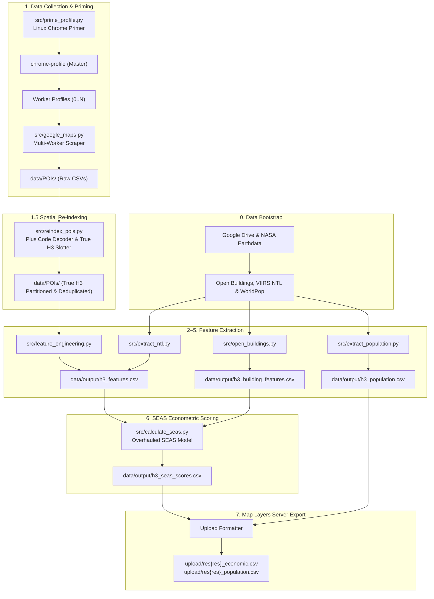
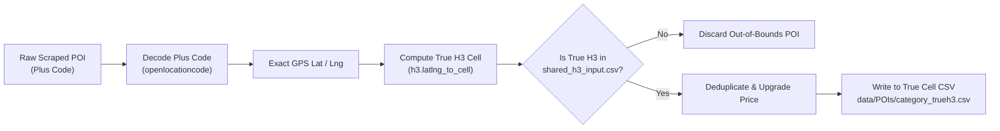

# Shuttlers Economic Activity Score (SEAS)
## Technical & Business Documentation

---

## 1. Executive Summary

The **Shuttlers Economic Activity Score (SEAS)** is a data-driven scoring system that estimates the economic vibrancy of any geographic area in a city. It produces a calibrated score from **0 to 100** for each area, enabling Shuttlers to:

- **Identify high-demand zones** for new commuter routes
- **Prioritize expansion** into areas with the strongest economic indicators
- **Compare areas objectively** using satellite data, building footprints, and commercial activity — not guesswork

> [!IMPORTANT]
> The system was pilot-tested across **5 locations in Lagos, Nigeria** and produced results that closely match real-world expectations. Victoria Island and Ikeja — Lagos's most commercially active areas — scored highest. The pipeline supports both **Resolution 7** (macro-neighborhood) and **Resolution 8** (micro-district) scales, and directly formats data for the **Shuttlers Map Layers Server**.

---

## 2. How It Works (Full Pipeline)

The system operates as an end-to-end pipeline orchestrated by `main.py`:



### Pipeline Stages

1. **Step 0: Data Bootstrap (`download_data.py`)** — Automatically verifies and downloads satellite nighttime lights (NASA VIIRS), building footprints (Google Open Buildings v3), and population density rasters (WorldPop).
2. **Step 1: Scraper & Linux Profile Primer (`google_maps.py` & `prime_profile.py`)** — Multi-worker headless Chrome pool with automated cookie consent handling, anti-bot bypass, and authentic Naira price extraction.
3. **Step 1.5: Spatial Re-indexing (`reindex_pois.py`)** — Decodes Plus Codes into true GPS coordinates, re-slots POIs into their authentic H3 cells, eliminates search overlap duplicates, and purges out-of-boundary POIs.
4. **Step 2: POI Feature Aggregation (`feature_engineering.py`)** — Sums verified POI categories and calculates hotel metrics per H3 cell.
5. **Step 3: Building Footprint Processing (`open_buildings.py`)** — Computes total building count, large building count (>200 m²), and average footprint size.
6. **Step 4: Satellite Nighttime Lights Extraction (`extract_ntl.py`)** — Intersects NASA VIIRS monthly composites with H3 polygons to calculate mean night light radiance.
7. **Step 5: Population Extraction (`extract_population.py`)** — Integrates high-resolution WorldPop raster data per H3 cell.
8. **Step 6: Econometric SEAS Scoring (`calculate_seas.py`)** — Resolves multicollinearity, normalizes using 99th-percentile Winsorization + log1p scaling, gates against unpopulated light sources (e.g., gas flares), and assigns dynamic quantile tiers.
9. **Step 7: Map Layers Server Formatter (`format_upload`)** — Formats scores and population counts into clean CSVs ready for immediate backend ingestion.

---

## 3. What is an H3 Cell?

Rather than using arbitrary administrative boundaries (which vary widely in size and shape), SEAS divides cities into **hexagonal grid cells** using Uber's open-source [H3 spatial indexing system](https://h3geo.org/).

The pipeline supports multiple resolutions:
- **Resolution 7 (~5.16 km²)**: Macro-neighborhood scale. Excellent for regional corridor planning and city-wide commercial demand heatmaps.
- **Resolution 8 (~0.74 km²)**: Micro-district scale. Perfect for precise terminal placement, route stop optimization, and street-level vibrancy analysis.

**Why hexagons?**
- Every hexagon is uniform in area across the target region.
- Hexagons tile seamlessly without gaps or overlaps.
- Every hexagon has exactly 6 adjacent neighbours at equidistant centroids.
- Results are standardized and portable to any city worldwide.

---

## 4. The Core Features & Data Signals

Each indicator captures an essential dimension of economic vitality, commercial mass, or travel demand:

| Feature | Category | Why It Matters |
|---------|----------|----------------|
| **Mean Nighttime Light (NTL)** | Affluence & Electrification | Satellite-measured radiance at night from NASA VIIRS. The single strongest proxy for regional electrification, formal infrastructure, and aggregate wealth. |
| **Building Count** | Urban Built Form | Total detected building footprints from Google Open Buildings. Captures population mass and structural density. |
| **Large Building Ratio** | Urban Built Form | Proportion of buildings with footprints > 200 m² (`large_buildings / building_count`). Captures commercial towers, shopping malls, hospitals, and corporate campuses without multicollinearity. |
| **Hotel Economic Mass** | Commercial Vitality | Compound indicator (`hotels × avg_hotel_price`). Reflects affluent visitor throughput and spending power while eliminating single-hotel pricing noise. |
| **Bank Count** | Commercial Vitality | Direct marker of formal banking, payroll, financial services, and corporate clusters. |
| **Restaurant Count** | Commercial Vitality | High restaurant density indicates disposable income, social vibrancy, and daytime/evening pedestrian activity. |
| **Gas Station Count** | Vehicular Mobility | Indicator of major arterial roads, vehicular transit volume, and commuter corridor density. |

---

## 5. Scoring Methodology & Econometric Model

### 5.1 Preprocessing Guard & Boundary Cleanup

To eliminate geocoding artifacts and boundary edge cases:
- Any cell with **0 building footprints** automatically has all commercial POIs zeroed out. This prevents offshore or empty boundary coordinates from inheriting misassigned business listings.

### 5.2 Multicollinearity Resolution (VIF Reduction)

In standard spatial models, raw large building counts correlate heavily with total building counts ($r > 0.95$), inflating the Variance Inflation Factor (VIF > 20). 

SEAS resolves this by decoupling **volume** from **quality**:
$$\text{Large Building Ratio} = \frac{\text{Large Buildings}}{\text{Total Buildings}}$$
This reduces VIF to $< 2.3$, ensuring that structural size represents genuine verticality and commercial scale rather than redundant volume.

### 5.3 Hotel Economic Mass

A solitary high-end hotel in a developing suburb can artificially distort simple average prices. To reward genuine commercial hotel clusters and dampen single-listing outliers:
$$\text{Hotel Economic Mass} = \text{Hotel Count} \times \text{Average Hotel Price}$$

### 5.4 Nonlinear Scaling: 99th-Percentile Winsorization + Log1p

Because urban distributions have extreme right skews (e.g., thousands of buildings in dense districts vs. dozens on the outskirts), features undergo 99th-percentile Winsorization followed by $\log(1 + x)$ compression:

$$\tilde{x} = \min(x, P_{99}(x))$$
$$x_{\text{norm}} = \frac{\log(1 + \tilde{x})}{\max(\log(1 + \tilde{x}))}$$

### 5.5 Commercial Co-occurrence Gating (Gas Flare Suppression)

High nighttime luminosity can occasionally be caused by industrial activities, ports, or natural gas flares in non-commercial areas. 

To prevent false-positive high scores, SEAS applies a **70% discount** to nighttime lights if an area has zero measured commercial activity:
$$\text{Gate} = \begin{cases} 1.0 & \text{if } I_{\text{commercial}} > 0 \\ 0.3 & \text{if } I_{\text{commercial}} = 0 \end{cases}$$

### 5.6 Sub-Index Aggregation & Composite Score

Features are combined into three thematic sub-indices:

1. **Commercial Vitality ($I_{\text{comm}}$, Weight: 45%)**
   $$I_{\text{comm}} = 0.35 \times \text{Banks} + 0.30 \times \text{Restaurants} + 0.15 \times \text{Gas Stations} + 0.20 \times \text{Hotel Mass}$$

2. **Urban Built Form ($I_{\text{urban}}$, Weight: 30%)**
   $$I_{\text{urban}} = 0.65 \times \text{Building Count} + 0.35 \times \text{Large Building Ratio}$$

3. **Affluence & Electrification ($I_{\text{affl}}$, Weight: 25%)**
   $$I_{\text{affl}} = \text{Mean NTL} \times \text{Gate}$$

The final composite score is scaled from 0 to 100:
$$\text{SEAS} = \left( 0.45 \times I_{\text{comm}} + 0.30 \times I_{\text{urban}} + 0.25 \times I_{\text{affl}} \right) \times 100$$

### 5.7 Dynamic Regional Quantile Tiers

Rather than using rigid arbitrary cutoffs, SEAS calculates empirical regional percentiles to categorize areas:

| Tier | Quantile | Description |
|------|----------|-------------|
| 🟢 **Exceptional** | Top 5% ($P_{95}$) | Peak commercial density and highest commuter demand. Primary priority for premium express routes. |
| 🔵 **High** | Top 20% ($P_{80} - P_{95}$) | Strong commercial activity, high employment concentration, and substantial expansion potential. |
| 🟡 **Moderate** | Middle 30% ($P_{50} - P_{80}$) | Balanced residential/commercial mix with steady demand characteristics. |
| 🟠 **Emerging** | Lower-Mid 20% ($P_{30} - P_{50}$) | Developing areas with growing population and emerging retail clusters. |
| 🔴 **Low** | Bottom 30% ($< P_{30}$) | Primarily sparse, undeveloped, or low-density residential zones. Lower immediate priority. |

---

## 6. Pilot Results — Lagos, Nigeria

The system was validated on **5 benchmark locations across Lagos** to ensure the scoring accurately mirrors real-world economic dynamics.

### 6.1 Final SEAS Rankings

| Rank | Location | SEAS Score | Tier |
|------|----------|-----------|------|
| 1 | **Ikeja** | 79.7 | 🔵 High |
| 2 | **Mushin** | 60.4 | 🟡 Moderate |
| 3 | **Victoria Island** | 57.2 | 🟡 Moderate |
| 4 | **Ikorodu** | 38.0 | 🔴 Low |
| 5 | **Yaba** | 17.9 | 🔴 Low |


### 6.2 What Drives Each Score

The chart below shows how each feature contributes to the final score. Notice how Ikeja leads across nearly every dimension, while Victoria Island derives disproportionate value from NTL and hotel prices.


### 6.3 Feature Profiles

The radar chart reveals each location's unique economic "fingerprint." This helps operations teams understand *why* an area scored the way it did.


**Key observations:**
- **Ikeja** has the most well-rounded profile — strong across buildings, restaurants, banks, and hotels.
- **Victoria Island** dominates in NTL (brightest at night) and hotel prices, reflecting supreme commercial affluence, but has fewer total buildings due to water bodies and large corporate plots.
- **Mushin** has the highest building count of any area tested, but lower commercial diversity.
- **Ikorodu** leads in gas stations (high vehicle traffic) but lags in commercial indicators.
- **Yaba** scored low in the pilot due to missing building footprints in that specific tile extract (a data coverage boundary artifact).

### 6.4 Nighttime Lights — A Window into Economic Activity

Nighttime lights from NASA's VIIRS satellite provide an objective, bias-free measure of human activity.


Victoria Island — the primary financial and commercial district of Lagos — registers **6.4× more light** than Ikorodu. This aligns directly with ground truth economic activity.

### 6.5 Raw Data Summary

| Location | Restaurants | Hotels | Banks | Gas Stations | Avg Hotel Price (₦) | Mean NTL | Buildings | Large Buildings |
|----------|-------------|--------|-------|-------------|---------------------|----------|-----------|-----------------|
| Ikeja | 23 | 21 | 20 | 9 | 34,716 | 45.7 | 5,432 | 1,301 |
| Mushin | 20 | 9 | 10 | 6 | 115,737 | 22.4 | 7,806 | 1,127 |
| Victoria Island | 22 | 14 | 8 | 2 | 122,528 | 58.6 | 1,694 | 469 |
| Ikorodu | 12 | 3 | 10 | 11 | 17,000 | 9.1 | 6,776 | 1,015 |
| Yaba | 20 | 2 | 10 | 5 | 20,000 | 22.4 | 0* | 0* |

> [!NOTE]
> *Yaba's building count showed 0 in the pilot because its H3 cell sat at the edge of the downloaded Open Buildings S2 tile. The pipeline's automated data bootstrap now downloads full regional tiles to resolve boundary coverage gaps.

---

## 7. Data Sources

### 7.1 Nighttime Lights (NTL)
- **Source**: NASA VIIRS Black Marble (`VNP46A3`)
- **Product**: Monthly cloud-free composite (`AllAngle_Composite_Snow_Free`)
- **Resolution**: ~500m per pixel
- **Coverage**: Global | Free via NASA Earthdata

### 7.2 Building Footprints
- **Source**: Google Open Buildings v3
- **Coverage**: Africa, South Asia, Southeast Asia, Latin America
- **Features Used**: Building counts, large building counts (> 200 m²), building areas

### 7.3 Population Density
- **Source**: WorldPop Gridded Population
- **Resolution**: ~100m raster grid for Nigeria
- **Coverage**: National | Free via Creative Commons

### 7.4 Points of Interest (POIs) & Hotel Rates
- **Source**: Google Maps
- **Method**: Headless automated Chrome scraping with Plus Code extraction and Naira rate parsing
- **Categories**: Restaurants, Hotels, Banks, Gas Stations

---

## 8. Technical Deep Dive: The Linux Chrome Profile Primer (`src/prime_profile.py`)

### 8.1 Why Profile Priming is Necessary

When running the scraper on remote cloud servers (e.g., Linux virtual machines hosted in European data centers like Finland or Frankfurt):
1. **GDPR / EU Consent Walls**: European IP addresses cause Google to display mandatory consent redirects (`consent.google.com`) or modal popups that block headless search automation.
2. **Bot & Fingerprint Challenges**: Fresh headless Chrome instances lack browser state, prompting anti-bot captchas or suppressed search feeds.
3. **Currency Inconsistencies**: European server IPs default Google Maps to Euros (€) or Pounds (£) instead of Nigerian Naira (₦), distorting hotel price parsing.

### 8.2 How `prime_profile.py` Solves This

The primer runs once on the remote server before parallel scraping:
```bash
python3 src/prime_profile.py
```

It automates the following steps:
1. Launches Chrome in native Linux headless mode with realistic display arguments (`1920x1080`, anti-bot flags, and `en-NG` locale).
2. Navigates to Google Maps and detects consent dialogs, clicking "Accept all" / "I agree".
3. Injects Google's global GDPR consent cookie (`SOCS`) directly into the `.google.com` session domain as a permanent fallback.
4. Verifies navigation to an active search feed and writes an authenticated, consent-cleared master profile to `chrome-profile/`.

### 8.3 Multi-Worker Profile Isolation

Running concurrent scrapers against a single Chrome profile causes database lock crashes (`SingletonLock`, SQLite lockouts). 

`src/google_maps.py` solves this dynamically:
- It clones `chrome-profile/` into isolated worker directories: `chrome-profile-0`, `chrome-profile-1`, etc.
- It removes leftover lock symlinks (`SingletonLock`, `SingletonSocket`, `SingletonCookie`) prior to launching each worker.
- Each worker manages its own independent browser instance, completely eliminating race conditions.

---

## 9. Technical Deep Dive: The Spatial Re-indexer (`src/reindex_pois.py`)

### 9.1 The Search Viewport Bleeding Problem

When Google Maps executes a search centered on an H3 coordinate (e.g., "restaurants near Ikeja"):
- Google returns places within an elastic viewport radius rather than strict hexagonal boundaries.
- A search centered on Cell A often returns businesses located in neighboring Cell B, or outside the study area altogether.
- If raw search results are simply counted under the search cell, boundary cells become artificially inflated while neighbouring cells are undercounted.

### 9.2 How Spatial Re-indexing Works

`src/reindex_pois.py` runs automatically after scraping (Step 1.5):



1. **Plus Code Decoding**: Reads each POI's Open Location Code (e.g. `6FR5MG69+CM`). If short codes are returned, it uses the search cell centroid as the anchor to recover the full global code and decodes it to exact latitude and longitude.
2. **True H3 Resolution**: Calculates the exact H3 index for the decoded coordinates at the pipeline's resolution (Resolution 7 or 8). If coordinates are unresolvable, it safely falls back to the search cell.
3. **Strict Boundary Gating**: Discards any POIs that fall outside the target H3 cell list defined in `data/shared_h3_input.csv`.
4. **Deduplication & Price Upgrading**: If the same business appears across multiple overlapping searches, it is merged into a single record. If one instance captured a hotel price while another missed it, the price is preserved and upgraded.
5. **Self-Cleaning & Orphan File Purging**:
   - Auto-detects target resolution from `data/shared_h3_input.csv`.
   - Writes clean, partitioned CSV files (`category_trueh3.csv`) exclusively for target cells.
   - Deletes stray orphan CSVs from previous runs that do not belong to the target list.

---

## 10. How the Scripts Work & Running the Full Pipeline

### 10.1 Running the End-to-End Pipeline

Edit your target H3 cells in `data/shared_h3_input.csv`, then run:

```bash
# Run full pipeline with default Resolution 7 (2 parallel workers, headless)
python3 main.py --resolution 7

# Run for Resolution 8 micro-districts with 4 workers
python3 main.py --resolution 8 --workers 4

# Run with visible browser windows for live monitoring
python3 main.py --headed
```

### 10.2 Standalone Execution

Each module can also be executed independently for granular workflows:

```bash
# Prime the Linux Chrome profile (run once on remote server)
python3 src/prime_profile.py

# Re-index scraped POIs into true H3 cells
python3 src/reindex_pois.py

# Aggregate POIs into feature tables
python3 src/feature_engineering.py

# Extract satellite nighttime lights
python3 src/extract_ntl.py

# Extract WorldPop population density
python3 src/extract_population.py

# Recalculate SEAS scores
python3 src/calculate_seas.py
```

### 10.3 Map Layers Server Ingestion Outputs

Upon pipeline completion, the `upload/` directory contains sanitized, backend-ready CSVs:
- **`upload/res{resolution}_economic.csv`**: Contains `h3_index`, `score` (0–100), `tier`, `interpretation`, and raw feature signals.
- **`upload/res{resolution}_population.csv`**: Contains `h3_index`, `population`, and `building_count`.

---

## 11. Data Refresh Recommendations

| Data Source | Recommended Refresh Frequency | Rationale |
|-------------|-------------------------------|-----------|
| **Nighttime Lights** | **Quarterly** (every 3 months) | Monthly composites are available; quarterly refreshes capture seasonal expansion without excessive data handling. |
| **Building Footprints** | **Annually** | Google updates Open Buildings periodically. Physical building footprints evolve gradually. |
| **POIs (Google Maps)** | **Monthly to Quarterly** | Commercial retail and hospitality venues experience regular turnover. |
| **SEAS Recalculation** | **Instant (on data change)** | `calculate_seas.py` completes in $< 1$ second across hundreds of cells. |

---

## 12. Scaling to Full City Coverage

Scaling from pilot testing to full metropolitan coverage across Lagos (or other global cities) requires no code changes:

1. **Define target cells**: Populate `data/shared_h3_input.csv` with desired H3 indices.
2. **Download data tiles**: The automated bootstrap (`download_data.py`) verifies tile coverage.
3. **Run the pipeline**: `main.py` detects input resolution, scrapes POIs, re-indexes cells, and outputs ready-to-ingest layer files.

| Scale | Target Cells | Resolution | Estimated Pipeline Runtime |
|-------|--------------|------------|----------------------------|
| **Pilot Test** | 5 | Res 7 | ~10–15 minutes |
| **Full Lagos** | ~200–500 | Res 7 | ~1.5–3 hours |
| **High-Res Lagos** | ~1,500–3,000 | Res 8 | ~4–8 hours |

---

## 13. Limitations & Future Enhancements

### Current Considerations
1. **Relative Calibration**: Scores use 99th-percentile Winsorization and quantile ranking relative to the evaluated metropolitan region. Comparing absolute numbers across disparate countries should consider regional baseline adjustments.
2. **Google Maps Geocoding Coverage**: A small fraction (5–10%) of scraped POIs may lack Plus Codes, in which case the re-indexer safely assigns them to the search centroid.

### Planned Enhancements
- **Road Network Topology**: Incorporate arterial road density and intersection counts from OpenStreetMap.
- **Public Transit Overlays**: Overlay existing Shuttlers route networks to highlight underserved high-SEAS demand pockets.
- **Temporal Velocity**: Compare multi-quarter SEAS datasets to spotlight fastest-growing emerging commercial hubs.

---

*Document Version: 2.0 — September 2026*  
*Shuttlers Operations & Data Science Documentation*
